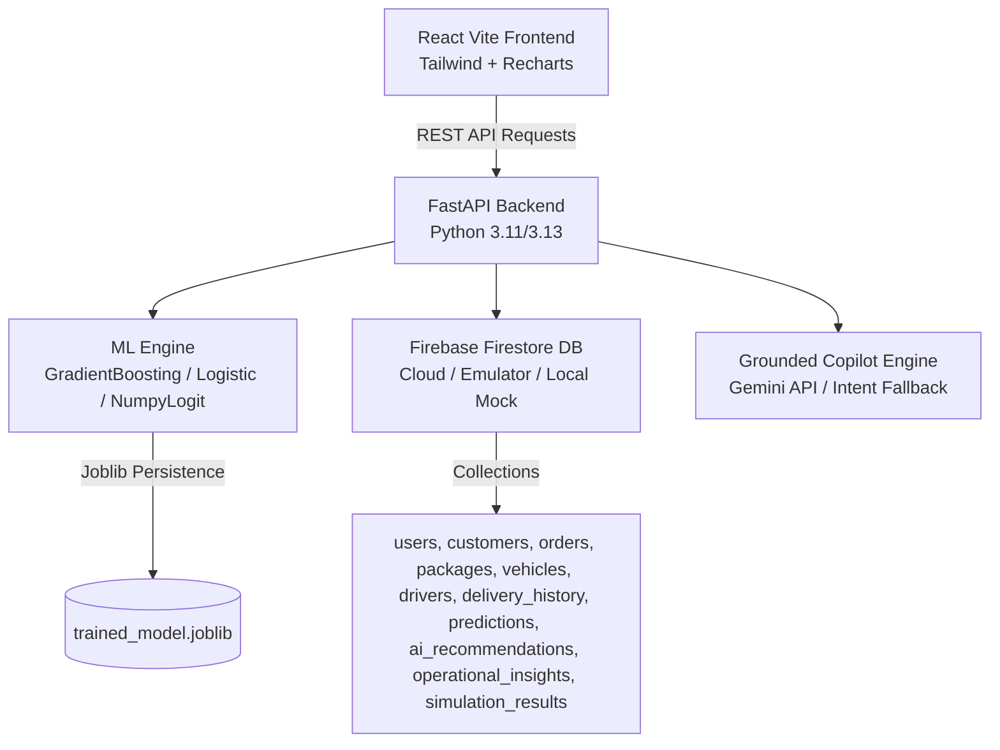

# LOGIX — AI Delivery Success Intelligence

> **Tagline:** *"Don't just optimize the route. Predict whether the delivery will succeed."*

LOGIX is an AI-powered Delivery Success Intelligence platform that predicts whether individual deliveries will succeed by analyzing customer behavior, package characteristics, vehicle compatibility, driver workload, delivery timing and historical outcomes. **We don't optimize the journey. We optimize the probability of successful delivery.**

---

## 🌟 Novelty Statement

> "LOGIX is an AI-powered Delivery Success Intelligence platform that predicts whether individual deliveries will succeed by analyzing customer behavior, package characteristics, vehicle compatibility, driver workload, delivery timing and historical outcomes. We don't optimize the journey. We optimize the probability of successful delivery."

---

## 🎯 Product Loop

```
Predict ➔ Explain ➔ Simulate ➔ Recommend ➔ Prevent
```

1. **Predict:** Computes success & failure probability ($0-100\%$) and risk levels (`LOW`, `MEDIUM`, `HIGH`, `CRITICAL`).
2. **Explain:** Evaluates per-order contributing factors in plain business language with direction and strength (`+++`, `---`). No raw ML jargon.
3. **Simulate:** "Delivery Decision Simulator" enables what-if parameter testing (time window, vehicle, driver, priority) with live percentage-point delta comparisons.
4. **Recommend:** Automated search space solver (`candidate window × vehicle × driver`) that finds the optimal risk-mitigating configuration.
5. **Prevent:** One-click "Apply AI Recommendation" updates Firestore records, re-runs predictions, and prevents delivery failure before departure.

---

## 🏗️ Architecture & System Design



---

## 🛠️ Tech Stack

- **Frontend:** React (Vite, TypeScript), React Router v6, Tailwind CSS v4, Recharts, Lucide Icons.
- **Backend:** Python 3.11+, FastAPI, Pydantic v2, Pandas, NumPy, scikit-learn, joblib.
- **Database:** Firebase Firestore via Firebase Admin SDK. Supports Cloud GCP credentials, Firestore Emulator, and Zero-Config Local Mock Store fallback out-of-the-box.
- **Copilot LLM:** Gemini 1.5 Flash via `GEMINI_API_KEY`, with a deterministic Firestore-grounded intent-routing engine fallback.

---

## 🚀 Quick Start Guide

### 1. Prerequisites & Environment Setup
Copy `.env.example` to `.env`:

```bash
cp .env.example .env
```

Configuration Options (`.env`):
```ini
FIREBASE_PROJECT_ID=logix-ai-demo

# Optional: Path to GCP Service Account JSON if connecting to real Cloud Firestore
# GOOGLE_APPLICATION_CREDENTIALS=./service-account.json

# Optional: Firestore Emulator host if running local emulator
# FIRESTORE_EMULATOR_HOST=localhost:8080

# Optional: Gemini API Key for Copilot LLM
# GEMINI_API_KEY=your_key_here

PORT=8000
HOST=0.0.0.0
```

### 2. Install Dependencies & Seed Synthetic Data

```bash
# Python Virtual Environment
python -m venv .venv
.\.venv\Scripts\python -m pip install -r backend/requirements.txt

# Frontend Install
cd frontend
npm install
cd ..

# Seed Synthetic Logistics Data & Train ML Model
.\.venv\Scripts\python scripts/seed.py
```

*Note: All synthetic data is clearly labeled **"Synthetic / simulated logistics data"** in the UI footer, README, and seed script.*

### 3. Launch App with One Command

```bash
python run.py
```

- **Frontend Dashboard:** [http://localhost:3000](http://localhost:3000)
- **Backend OpenAPI Docs:** [http://localhost:8000/docs](http://localhost:8000/docs)

---

## 🧪 Running Unit & Integration Tests

Run the full pytest suite (11 tests covering ML feature builders, risk classifiers, predictor logic, and API endpoints):

```bash
.\.venv\Scripts\python -m pytest tests/
```

---

## 🎬 Live Hackathon Demo Walkthrough Script

Follow these 6 steps to demonstrate the LOGIX system end-to-end:

1. **Dashboard Overview:**
   - Open [http://localhost:3000](http://localhost:3000).
   - Observe the headline: *"Today's predicted delivery success: 87.2%"* computed live from 80 scheduled orders.
   - Note the KPI cards showing Total Deliveries (80), Successful (70), At-Risk (10), and Critical Risk (3).

2. **Hero Demo Order Investigation (O1024):**
   - Click **"At-Risk Deliveries"** in the sidebar.
   - Locate hero demo order **`O1024`** (Medicine, assigned morning window, ~78% risk level).
   - Click **"Investigate"**.

3. **Plain-Language AI Explanation & Recommendation:**
   - On the Order Detail page for `O1024`, inspect the **"Why? Factor Breakdown"**:
     - `"Customer usually unavailable during Morning (8–11 AM)  ---"`
     - `"Compatible cold-chain vehicle equipped with active refrigeration  +++"`
   - Review the **Current Plan** (Morning, ~22% success) vs **AI Recommended Plan** (Evening 6–8 PM, ~95% success).
   - Click **"Why this recommendation?"** to see the numbered plain-language steps.

4. **Apply AI Recommendation:**
   - Click **"Apply AI Recommendation"**.
   - Observe the live transition: Order updated in Firestore from **22%** $\rightarrow$ **95%** success rate.
   - Return to Dashboard to see the headline KPI update live.

5. **Decision Simulator ("What-If"):**
   - Click **"Decision Simulator"** in the sidebar.
   - Select order `O1041` or `O1024`.
   - Change vehicle assignment from `V02` (Standard Van) to `V01` (Refrigerated Van) or shift time window.
   - Observe the live comparison cards, percentage point delta badge, and Recharts bar chart.

6. **LOGIX Copilot:**
   - Click **"LOGIX Copilot"** in the sidebar.
   - Click the prompt chip: *"What is the biggest delivery problem today?"*
   - Receive a data-grounded response explaining that 48% of risk stems from customer availability mismatches in assigned morning windows.

---

## 📡 API Endpoint Reference

| Method | Endpoint | Description |
| :--- | :--- | :--- |
| `GET` | `/health` | Service health & database connection mode check |
| `GET` | `/risk-summary` | Live KPI stats & predicted daily success rate |
| `GET` | `/orders` | List all orders (supports `?risk=CRITICAL`) |
| `GET` | `/orders/{id}` | Order details, package context, prediction & recommendation |
| `POST` | `/orders` | Create new order and run initial ML prediction |
| `PATCH` | `/orders/{id}` | Update order parameters and re-evaluate ML risk |
| `POST` | `/predict-delivery` | Ad-hoc ML risk prediction |
| `POST` | `/recommend-delivery` | Search solver for optimal risk-mitigating candidate |
| `POST` | `/orders/{id}/apply-recommendation` | Apply recommendation to Firestore order |
| `POST` | `/simulate` | Run what-if simulation with parameter overrides |
| `GET` | `/customers` | Customer list with window availability intelligence |
| `GET` | `/vehicles` | Vehicle fleet with refrigeration/fragile suitability |
| `GET` | `/drivers` | Driver workload scores & capacity tracking |
| `GET` | `/insights` | 30-day zone success rates & operational patterns |
| `POST` | `/copilot/query` | Grounded AI copilot query interface |
